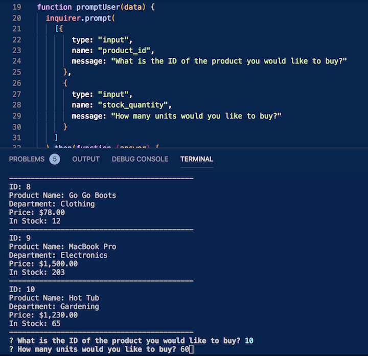
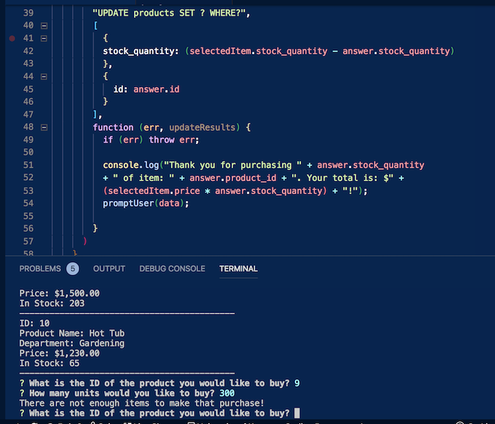

# Bamazon

## Summary
The Bamazon app will take in orders from customers and deplete stock from the store's inventory.

## Languages Used
This application uses MySQL, JavaScript, and Node.JS.

## Introduction
As the customer, you will first be shown a list of products to choose from. The product list is read from a SQL database - including product ID,  name, department, and price. The program will then ask the ID of the product you would like to purchase.

## Shopping Time
Once you have viewed the product list, write in the ID of the product you are interested in purchasing. You will be prompted to then provide the quantity of the said product.

## Good to Go
If there is enough product of the quantity you suggested, your purchase will be made. The total cost will display and the quantity you chose will be deducted from its original amount. You will then be redirected to purchase another product.

## Uhhoh! Not Enough!
If there is not enough product of the quantity you suggested, the program tells you as much and redirects you to the original question.

