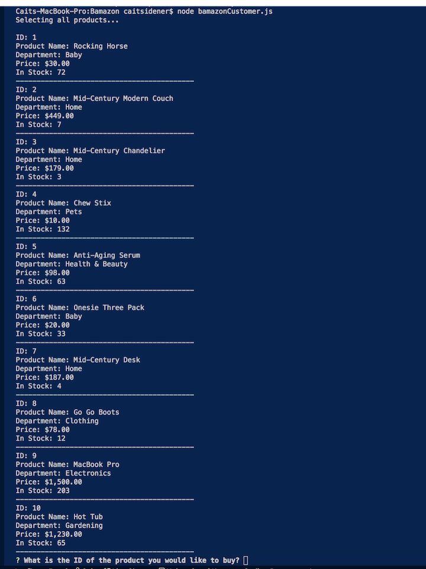

# Bamazon

## Summary
The Bamazon app will take in orders from customers and deplete stock from the store's inventory.

## Languages Used
This application uses MySQL, JavaScript, and Node.JS.

## Introduction
As the customer, you will first be shown a list of products to choose from. The product list is read from a SQL database - including product ID,  name, department, and price. The program will then ask the ID of the product you would like to purchase.

